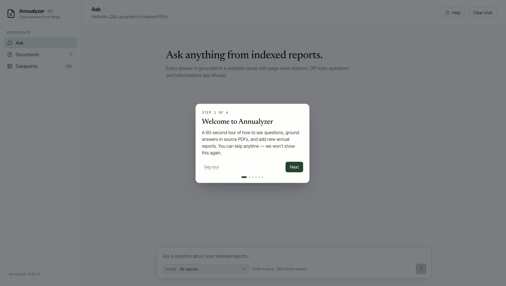
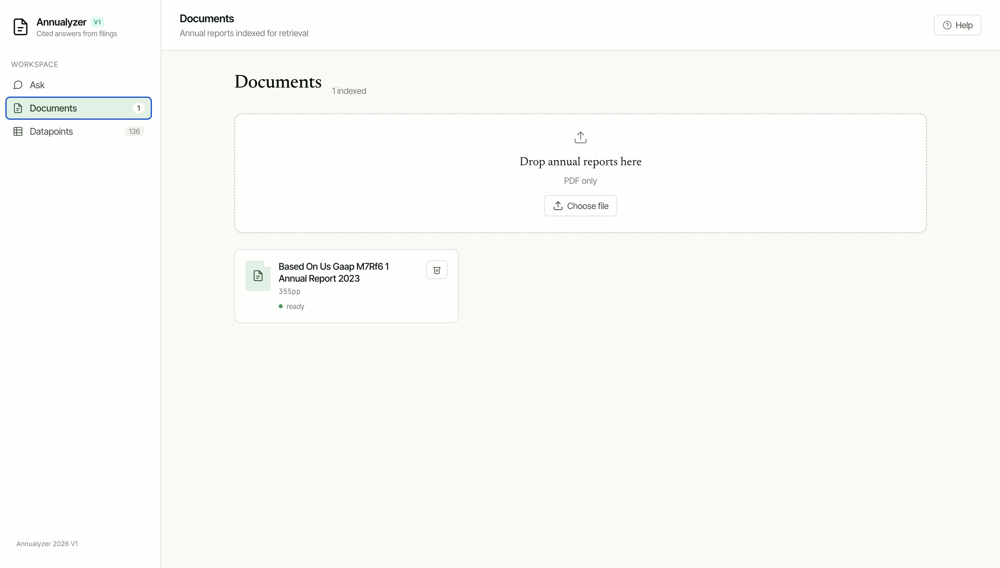
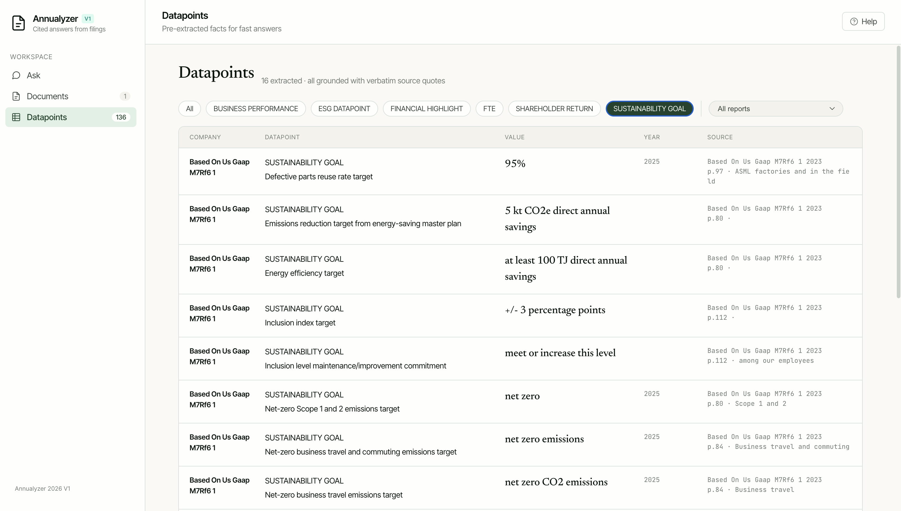
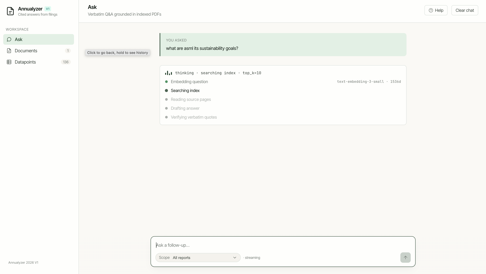
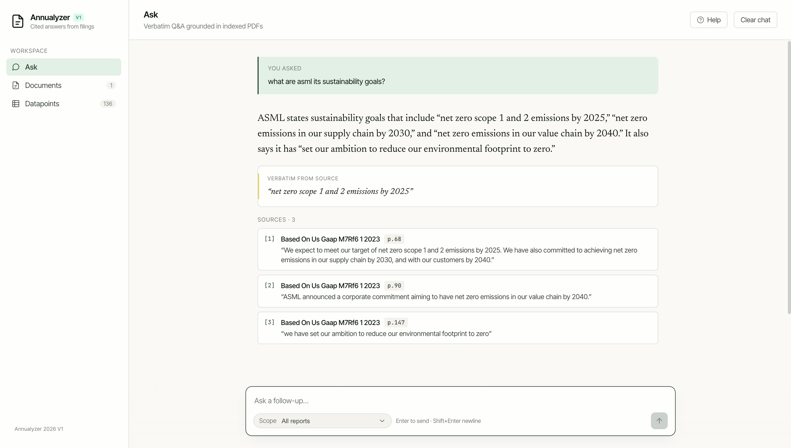

# Annual Report RAG

Annual Report RAG is a local retrieval-augmented generation system for asking cited questions over annual report PDFs.

It gives you a small web app where you can upload reports, index them, browse extracted datapoints, and ask questions in plain language. Answers are grounded in the indexed report text and include page citations so users can trace claims back to the original filing.

The system is designed to stay multi-company-ready: each indexed chunk carries source, company, and year metadata, and questions can be scoped to a specific company/year when needed.

## How it works

1. A user uploads one or more annual report PDFs.
2. The backend parses the PDFs, extracts page text, chunks the report, and stores metadata for each chunk.
3. Chunk text is embedded and persisted in Chroma for semantic retrieval.
4. The system also extracts structured datapoints for faster lookup of common annual-report facts.
5. When a user asks a question, the backend retrieves relevant chunks, reranks them, and sends the grounded context to the answer model.
6. The answer layer returns either a cited answer or a refusal when the corpus does not support the question.

Conversation history is supported. If a user asks a follow-up such as `What about 2024?`, the backend rewrites that into a standalone question before retrieval.

## Evaluation results

- Accuracy: 90%
- Faithfulness: 92%
- Answer relevance: 93%
- Context recall: 85%
- Context precision: 80%

## Product preview

### Guided onboarding

The app opens with a short walkthrough that introduces the workspace, document upload flow, datapoint explorer, and cited Q&A experience.



### Document workspace

Reports can be uploaded through the document view, where indexed PDFs show their parsed page count and readiness status.



### Extracted datapoints

The datapoint explorer surfaces structured facts such as ESG goals, FTE figures, financial highlights, and shareholder-return datapoints with source references.



### Retrieval and cited answers

During question answering, the interface shows retrieval progress before returning a grounded response with verbatim source quotes and page-level citations.





## What is in the codebase

- `backend/app/`
  FastAPI server, retrieval, answering, ingestion, parsing, chunking, embeddings, and datapoint extraction.
- `backend/evals/`
  YAML eval sets and the RAGAS evaluation runner.
- `backend/tests/`
  Focused backend tests.
- `frontend/src/`
  React frontend for chat, documents, and datapoints.
- `backend/data/`
  Local runtime data only. This is where reports, processed artifacts, and Chroma persistence live.

## Main features

- Upload annual report PDFs through the UI.
- Parse and chunk reports, then store them in Chroma.
- Extract structured datapoints such as FTE, ESG, financial highlights, and shareholder-return facts.
- Ask grounded questions with citations.
- Ask several questions in a row and continue with follow-up questions.
- Run RAGAS evaluations against YAML question sets.

## Requirements

- Docker Desktop
- Keys for Hugging Face, OpenAI, and Llama Parse
- A `.env` file with valid keys:

```env
OPENAI_API_KEY=...
LLAMA_CLOUD_API_KEY=...
HF_TOKEN=...
```

## Running with Docker

Start the full stack with:

```bash
docker compose up -d --build
```

If you prefer the older command spelling and your machine supports it:

```bash
docker-compose up --build
```

The app is hosted at:

```text
http://localhost
```

To watch backend logs:

```bash
docker compose logs -f backend
```

To stop everything:

```bash
docker compose down
```

## First startup

The first startup can take a bit longer.

The initial Docker build can also take a few minutes because some dependencies in this stack are fairly large, especially the ML-related libraries.

This project currently downloads the BAAI reranker at runtime on first start. You may need to wait a little before the system becomes ready. We are doing this because GitHub Actions has issues at the moment, and downloading the model outside the image is faster for us than baking it into the image during every build ;)

You may also see slower startup if the Hugging Face cache volume was removed and the reranker has to be downloaded again.

## How to use it

1. Open `http://localhost`.
2. Wait until the system is ready.
3. Upload one or more annual report PDFs.
4. Wait for indexing to finish.
5. Ask simple questions first, then continue with follow-up questions if needed.

Examples:

- `How many FTE did the company have in 2025?`
- `What was ASML's net income in 2025?`
- `Who was the CEO?`
- `What about 2024?`

The last two examples are follow-ups. The system uses recent chat history to resolve them when history is available.

## Runtime data

Generated data is stored under:

- `backend/data/reports`
- `backend/data/processed`
- `backend/data/chroma`

This data is runtime state, not source code.

## Evaluations

RAGAS eval files live in `backend/evals/`.

Example context precision & context recall:

```bash
.venv/bin/python -m backend.evals.ragas_eval \
  --questions backend/evals/asml-2025-questions.yaml \
  --company "ASML" \
  --year 2025 \
  --metrics context \
  --runs-dir backend/evals/results
```

Example for faithfulness & answer relevancy:

```bash
.venv/bin/python -m backend.evals.ragas_eval \
  --questions backend/evals/asml-2025-questions.yaml \
  --company "ASML" \
  --year 2025 \
  --metrics faithfulness \
  --runs-dir backend/evals/results
```

## Notes

- The reranker is currently configured through `.env`.
- First-run latency is expected to be higher than steady-state latency.
- If you want a fully clean local reset, remove `backend/data` and run `docker compose down -v`.
